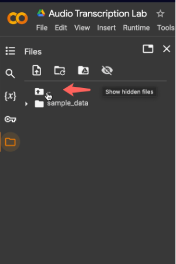
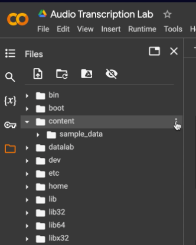
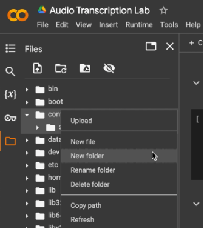
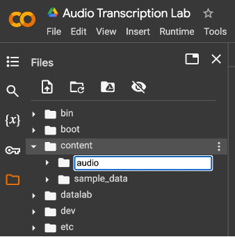
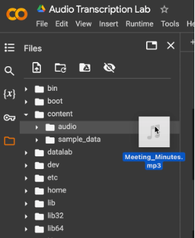
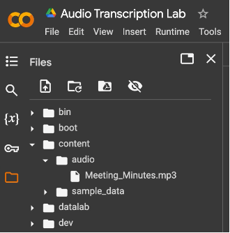

# Lab 4: Insights from Audio Transcription

---


## 📘 Introduction

In this lab, you'll dive into the world of audio transcription by taking a short meeting recording and turning it into text. You'll learn how to pull out the most important bits like the summary, key points, and action items, figure out the overall mood, and then wrap it all up by saving your polished meeting minutes as a text file. 


---


## 🎯 Learning Objectives

- **Understand the Capabilities of OpenAI's Speech Transcription Models**: Gain a foundational understanding of what OpenAI's speech transcription model Whisper is capable of, including strengths and limitations.
- **Develop Skills in Using OpenAI's API for Speech Transcription**: Learn to effectively utilize OpenAI's API to generate transcriptions, including setting up the necessary development environment, understanding API documentation, and executing API calls.
- **Creating a txt File**: Learn how to write the code for creating a txt file and store desired information.


---

## ⏱️ Estimated Time
3 hours

---

## 💵 Estimated Cost
$1 (View your OpenAI usage [here]((https://platform.openai.com/usage))

---

## 🧰 Materials

- OpenAI account & API key
- [Audio Transcription Colab](https://colab.research.google.com/drive/1AKP0Tw-TNUEbyOw_ykm9Xp4xW1g6kfVV?usp=sharing)
- [Meeting_Minutes.mp3](https://drive.google.com/file/d/1VuNnF4_EPLr1uVhdgK69206oDya88DvY/view?usp=sharing)


---


## ⚙️ 1.1 Setting Up Your Development Environment

1. Make a copy of the [Audio Transcription Colab](https://colab.research.google.com/drive/1AKP0Tw-TNUEbyOw_ykm9Xp4xW1g6kfVV?usp=sharing)

2. To set up your development environment, you will need to have Python installed. You will also need to install the OpenAI Python library, which we will use to generate text in this lab. You can run the following shell scripts, which are also pre-written in the first cell of your Colab notebook, to do so.

```Python
# Uninstall Colab's preinstalled modules which have dependency conflicts with
# the OpenAI Python library.
!pip uninstall tensorflow-probability -y
!pip uninstall llmx -y
# Install the OpenAI Python library.
!pip install --upgrade openai
```

3. We also want to create a folder to save the txt file for the text that we generate. Navigate to the “Files” section of the left sidebar by clicking on the file icon. In Files, you will see a folder named sample_data. Navigate to its parent folder by clicking the file icon which has an up arrow inside. Find the content folder, and within it create a new folder named **minutes**. 

(For more detailed information and screenshots of this process, refer to Steps 3-5 of the “Setting Up Your Development Environment” section of the Generating Images with OpenAI’s Models lab. Be sure to name your folder **minutes**.)

---


## 📥 1.2 Importing and Initializing OpenAI

1. Now that you have the OpenAI Python library installed, we can begin to code. At the top of your cell, import requests and OpenAI.

```Python
from openai import OpenAI
```


2. Next, initialize an OpenAI object. This will allow you to use the OpenAI API to communicate with OpenAI’s models. Make sure to **replace your-api-key-here** with your API key.

```Python
client = OpenAI(api_key='your-api-key-here')
```

---


## 🎙️ 2.1 Function to Transcribe the Audio

1. Create a function titled **transcribe_audio** with 1 parameter **audio_path_file**.
- This function will be used to transcribe the audio file using Whisper

```Python
def transcribe_audio(audio_path_file):
```

2. **audio.transcriptions.create** is a function from the OpenAI Python Library which generates a text transcription of an audio file it is given.

**open(audio_file_path, "rb")** opens the audio file using the **rb** mode. **r** for read and **b** for ‘binary’ indicates that the file has permission to be read in binary.

So far, OpenAI only has one model for speech recognition, Whisper, so we set the **model** to **whisper-1** as default. Since **audio.transcriptions.create** returns a Transcription object, which we’ve named **transcription**, we extract and return the transcribed text from the object with **transcription.text**.

```Python
# Given the path to an audio file, transcribes the audio using Whisper.
def transcribe_audio(audio_file_path):
    audio_file = open(audio_file_path, "rb")
    transcription = client.audio.transcriptions.create(
        model="whisper-1", 
        file=audio_file
    )
    return transcription.text
```

---


## 🧾 2.2 Function to Obtain a Summary

1. Create a function titled **abstract_summary_extraction** with 1 parameter **transcription**.
- This function will be used to prompt OpenAI to generate a summary of the transcription

```Python
# Takes the transcription of the meeting and returns a summary of it via text completions
def abstract_summary_extraction(transcription):
```

2. The **abstract_summary_extraction** function uses the **chat.completions.create** function from the **Generating Text with OpenAI’s Models lab** to have GPT generate a summary of the transcription. 

```Python
def abstract_summary_extraction(transcription):
    response = client.chat.completions.create(
        model="gpt-3.5-turbo",
        temperature=0,
        messages=[
            {
                "role": "system",
                "content": "You are a highly skilled AI trained in language comprehension and summarization. I would like you to read the following text and summarize it into a concise abstract paragraph. Aim to retain the most important points, providing a coherent and readable summary that could help a person understand the main points of the discussion without needing to read the entire text. Please avoid unnecessary details or tangential points."
            },
            {
                "role": "user",
                "content": transcription
            }
        ]
    )
    return response.choices[0].message.content
```

---


## 📌 2.3 Function to Obtain Key Points

1. Create a function titled **key_points_extraction** with 1 parameter **transcription**.
- This function will be used to extract key points from the transcribed audio

```Python
# Takes the transcription of the meeting and returns the key points in it via text completions 
def key_points_extraction(transcription):
```

2. The **key_points_extraction** function uses the **chat.completions.create** function from the **Generating Text with OpenAI’s Models** lab to give GPT the role of extracting the key points from the transcription.

```Python
def key_points_extraction(transcription):
    response = client.chat.completions.create(
        model="gpt-3.5-turbo",
        temperature=0,
        messages=[
            {
                "role": "system",
                "content": "You are a proficient AI with a specialty in distilling information into key points. Based on the following text, identify and list the main points that were discussed or brought up. These should be the most important ideas, findings, or topics that are crucial to the essence of the discussion. Your goal is to provide a list that someone could read to quickly understand what was talked about."
            },
            {
                "role": "user",
                "content": transcription
            }
        ]
    )
    return response.choices[0].message.content
```

---


## 🚀 2.4 Function to Obtain Action Items

1. Create a function titled **action_item_extraction** with 1 parameters **transcription**.
- This function will be used to define the action items from the transcription.

```Python
# Takes the transcription of the meeting and returns the action items from it via text completions 
def action_item_extraction(transcription):
```

2. The **action_item_extraction** function uses the **chat.completions.create** from the **Generating Text with OpenAI’s Models** lab to have GPT determine the action items within the transcript.

```Python
def action_item_extraction(transcription):
    response = client.chat.completions.create(
        model="gpt-3.5-turbo",
        temperature=0,
        messages=[
            {
                "role": "system",
                "content": "You are an AI expert in analyzing conversations and extracting action items. Please review the text and identify any tasks, assignments, or actions that were agreed upon or mentioned as needing to be done. These could be tasks assigned to specific individuals, or general actions that the group has decided to take. Please list these action items clearly and concisely."
            },
            {
                "role": "user",
                "content": transcription
            }
        ]
    )
    return response.choices[0].message.content
```

---

## 🧠 2.5 Function to Analyze the Overall Sentiment

1. Create a function titled **sentiment_analysis** with 1 parameter **transcription**.
- This function will be used to analyze the sentiment from the text. 

```Python
# Takes the transcription of the meeting and returns the key points in it via text completions 
def sentiment_analysis(transcription):
```

2. The **sentiment_analysis** function utilizes the **chat.completions.create** function from OpenAI that we used in the **Generating Text with OpenAI’s Models** lab to analyze the overall tone and emotion conveyed in the transcript. 

```Python
def sentiment_analysis(transcription):
    response = client.chat.completions.create(
        model="gpt-3.5-turbo",
        temperature=0,
        messages=[
            {
                "role": "system",
                "content": "As an AI with expertise in language and emotion analysis, your task is to analyze the sentiment of the following text. Please consider the overall tone of the discussion, the emotion conveyed by the language used, and the context in which words and phrases are used. Indicate whether the sentiment is generally positive, negative, or neutral, and provide brief explanations for your analysis where possible. Please keep it to fewer than 5 sentences."
            },
            {
                "role": "user",
                "content": transcription
            }
        ]
    )
    return response.choices[0].message.content
```

---


## 📝 3.1 Function to Obtain Meeting Minutes

1. Create a function titled **meeting_minutes** with 1 parameter **transcription**.
- This function will be used to return all the results gathered 

```Python
def meeting_minutes(transcription):
```

2. Within the function, call the other functions that you have defined and assign them to according variables: **abstract_summary_extraction, key_points_extraction, action_item_extraction, and sentiment_analysis**.  

Return a dictionary where each variable (values in the dictionary) is paired with their corresponding key.

```Python
# Taken directly from OpenAI's documentation for a meeting minutes generator.
def meeting_minutes(transcription):
    abstract_summary = abstract_summary_extraction(transcription)
    key_points = key_points_extraction(transcription) 
    action_items = action_item_extraction(transcription)
    sentiment = sentiment_analysis(transcription)
    return {
        'abstract_summary': abstract_summary,
        'key_points': key_points,
        'action_items': action_items,
        'sentiment': sentiment
    }
```

---


## 💾 3.2 Function to Store the Transcription Analysis into a txt File

1. Create a function titled **makeTxt** with 2 parameters **filename** and **string**.
- This function will be used to create a txt file in your **minutes** folder that will contain the summary, key points, action items, and sentiment that were generated.

```Python
def makeTxt(filename, string):
```

2. This function takes the argument  and opens the file to **"w"** (write mode), edits it by writing the string to the file, and closes it. 

```Python
def makeTxt(filename, string):
    file = open(filename, "w")
    file.write(string)
    file.close()
```

---


## 🔄 4.1 Using the Functions with User Input

1. Now that we have many functions that can either transcribe an audio file or generate meeting minutes, let's try it out! We’ve provided a sample meeting recording at [Meeting_Minutes.mp3](https://drive.google.com/file/d/1VuNnF4_EPLr1uVhdgK69206oDya88DvY/view?usp=sharing) but feel free to find your own. Keep in mind that it must be less than 25 MB large.


2. Upload your meeting recording to the Colab as follows:

<div align="left">
  
  
</div>

<div align="left">
  
  
</div>

<div align="left">
  
  
</div>


3. Prompt the user to enter the relative path to their audio file so we can then pass the file to OpenAI to transcribe. The relative path of a file is its location in your device or software, relative to the folder you are currently in. 

```Python
audio_file_path = input("Enter the path to an audio file with size <25MB: ")
```

4. Pass the path obtained into the **transcribe_audio** function that we have created earlier and store the resulting transcription in the **transcription** variable.

```Python
transcription = transcribe_audio(audio_file_path)
```

5. Obtain the meeting minutes by giving the **transcription** to the **meeting_minutes** function. Store it in the **minutes** variable.

```Python
minutes = meeting_minutes(transcription)
```

---


## 📂 4.2 Displaying the Information in the Terminal and Saving a txt File

1. Now that we can generate meeting minutes from a recording, we want to be able to save the minutes for future reference. We’ll do this in a txt file. Create a variable named **minutes_filename**, which will store the name of our txt file. 

```Python
minutes_filename = "minutes/" + audio_file_path.split("/")[-1].split(".")[0] + ".txt"
```

2. Next, create a variable named **title**. This variable will store the title of our meeting minutes file.

```Python
title = "MEETING MINUTES for " + audio_file_path.split("/")[-1].split(".")[0] + "\n\n"
```

3. Create variables **abstract_summary, key_points, action_items, and sentiment**. In these variables, concatenate their headings with the corresponding information from the **minutes** dictionary. We use **"\n”** to create line breaks for readability.

```Python
abstract_summary = "ABSTRACT SUMMARY\n" + minutes["abstract_summary"] + "\n\n"
key_points = "KEY POINTS\n" + minutes["key_points"] + "\n\n"
action_items = "ACTION ITEMS\n" + minutes["action_items"] + "\n\n"
sentiment = "SENTIMENT\n" + minutes["sentiment"] + "\n\n"
```

4. Let's use the **makeTxt** function to generate a txt file with the information, concatenating the variables you have defined above (title, abstract_summary, key_points, action_items, sentiment) with a “+” sign.

```Python
makeTxt(minutes_filename, title + abstract_summary + key_points + action_items + sentiment)
```

5. Finally, display our results in the terminal. Make sure the user knows where their txt file has been saved by displaying **minutes_filename**.

```Python
print("----------------------------------------------")
print(title + abstract_summary + key_points + action_items + sentiment)


# Feedback message
print("----------------------------------------------")
print("Meeting minutes saved to", minutes_filename + "!")
```

6. Now that we know how to retrieve meeting minutes for a user-specified audio file, run the code from Sections 4.1 and 4.2 with the meeting recording you uploaded in Steps 1-2 of Section 4.1. Find the txt file you’ve created!

7. Find another recording of your own and run this code again. You may consider recording a mock interview to see how you did! Remember the audio file should be less than 25MB. This will be part of your submission, so please do not upload and use any audio file that may contain information that you do not want to show to the instructor. Make sure to use different file names for the audio file and the meeting minutes.


---


## ✅ Congratulations, you have successfully finished the lab

Please submit your work as a PDF file with 

1) a Colab link to your code

2) Screenshot of the audio file summary output in Colab and in txt file after Step 6 of Section 4.2

2) a link to the audio file in Step 7 of Section 4.2

3) Screenshot of the audio file summary output in Colab and in txt file after Step 7 of Section 4.2

4) Screenshots of your usage page including both Cost and Activity

5) your reflections of this lab through this survey. Please include a screenshot of your answers in the PDF file.
   - https://docs.google.com/forms/d/1GHPEib_mVqnz56-TxeWKxD3ResiWii3wn79clqYAfrs/edit 

To help the teaching team grade your lab effectively and to protect your API security, please follow these steps before submitting:

1. Update your audio file setting so that everyone in SJSU group can access as a viewer;

2. Update your Colab setting so that everyone in SJSU group can access as a viewer;

3. Please change your API key in your code to **“my-api-key-here”**


---


## 📚 References
- [Tutorial meeting-minutes](https://platform.openai.com/docs/tutorials/meeting-minutes)
- [API Reference - CreateTranscription](https://platform.openai.com/docs/api-reference/audio/createTranscription)


